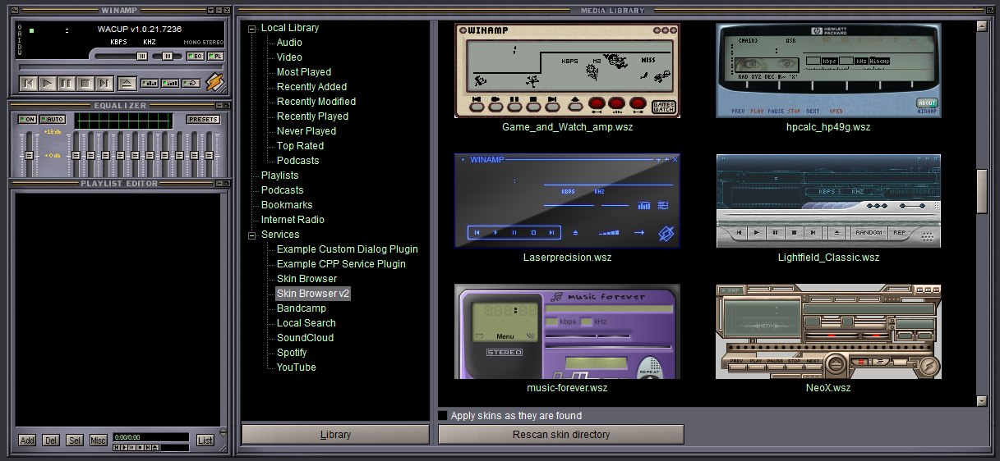

# WinampEasyService
Making it easier to integrate services with good old WinAmp

Goal:
* Make it easier to write plugins and integrate services into WinAmp and WACUP

Installing plugins:
* Put the ml_easysrv and in_easyfngetter plugins in the WinAmp or WACUP `Plugins` folder
* Also put isrv_managed in the WinAmp or WACUP `Plugins` folder
* Put any service plugins (`esrv_\*.exe, msrv_\*.dll, srv_\*.dll`) in the same folder
* The services will be accessible in the `Services` tree of the Media Library

Using plugins (Instead of this, plugins can now provide their own custom UI):
* Press the `Invoke plugin` button to interact with the selected service
* Double click an entry in the list to play it
* Alt + double click an entry in the list to enqueue it

Service plugin development:
* Managed (.NET based) DLLs have to be named `msrv_\*.dll` and contain the `msrv.EasyService` class implementing the following:
    * `public string GetNodeName()` should return the name you wish to show in the Media Library
    * `public List<List<string>> InvokeService(int PlayerType)` should return the entries to populate the Media Library ListView with
        * The inner lists should always contain four strings in this order: Artist, Title, Info, Filename
        * The Filename can be a direct filename (e.g. `e:\\example.mp3`) or a reference (e.g. `ref_examplefile`)
        * PlayerType is 0 for WinAmp, 1 for WACUP
    * Optional: `public string GetFileName(string fileID)` should return the direct filename when called with a reference
    * Important: If you wish to show a window, call `ShowWindow(form.Handle, SW_SHOW);` on your Form after creation
        * ShowWindow resides in `user32.dll`, `SW_SHOW` equals 5
    * Full example: `WinampEasyService\\msrv_exampledll`
* Unmanaged DLLs have to be named `srv_\*.dll` and implement the functions in `WinampEasyService\\ml_easysrv\\easysrv.h`:
    * `const wchar_t\* GetNodeName()` should return the name you wish to show in the Media Library
    * `ItemInfo InvokeService(int PlayerType)` should return the first entry to populate the Media Library ListView with
        * `ItemInfo` contains the following: Artist, Title, Info, Filename
        * The Filename can be a direct filename (e.g. `e:\\example.mp3`) or a reference (e.g. `ref_examplefile`)
        * PlayerTypes are defined in `easysrv.h`
    * `ItemInfo InvokeNext(int PleyerType)` should return the next entry to populate the Media Library ListView with
        * Return and empty `ItemInfo()` to denote the end of the list
    * Optional: `const wchar_t\* GetFileName(const wchar_t\* fileID)` should return the direct filename when called with a reference
    * Full example: `WinampEasyService\\srv_exampledll`
* Unmanaged DLLs with custom UIs have to be named `srv_\*.dll` and implement the functions in `WinampEasyService\\ml_easysrv\\easysrv.h`:
    * `const wchar_t\* GetNodeName()` should return the name you wish to show in the Media Library
    * `HWND GetCustomDialog(HWND _hwndWinampParent, HWND _hwndLibraryParent, HWND hwndParentControl)` should return the HWND of the newly created child dialog
    * Full example: `WinampEasyService\\srv_cdlexampledll`
* EXE files (doesn't matter if managed or unmanaged) have to be named `esrv_\*.exe` and respond to the following command line arguments:
    * `GetNodeName`: Print the name you wish to show in the Media Library to STDOUT
    * `InvokeService PlayerType`: Print the entries to populate the Media Library ListView with to STDOUT in the following way:
        * `Artist\\nTitle\\nInfo\\nFilename\\n`
        * Quit when done
        * `PlayerType` can be `PLAYERTYPE_WINAMP` or `PLAYERTYPE_WACUP`
    * Optional: `GetFileName FileID`: Print the direct filename corresponding to the reference `FileID` to STDOUT
    * Important: If you wish to show a window, call `ShowWindow(form.Handle, SW_SHOW);` on your Form after creation
        * ShowWindow resides in `user32.dll`, `SW_SHOW` equals 5
    * Full example: `WinampEasyService\\esrv_exampleexe`

Bugs:
* WinAmp crashes in list_OnNotify in ml_easysrv
    * WACUP works correctly
* WinAmp/WACUP doesn't display metadata for `webm` files

# ServicePlugins

The following plugins have been developed using this framework:
* esrv_bandcamp: Bandcamp integration
    * Needs a username and the content of the identity cookie
    * Can save credentials for later
    * Only works for purchased items
    * Works for both tracks and albums
* esrv_localsearch: Local file search
    * Searches the given directory for the given file pattern
    * Has recursive search option
* esrv_soundcloud: SoundCloud integration
    * Uses SoundCloudExplode under the hood
* esrv_spotify: Spotify integration
    * Falls back to YouTube if a track is unavailable and its YouTube ID is set
    * Uses SpotifyExplode and YouTubeExplode under the hood
* esrv_youtube: YouTube integration
    * Unfortunately slow
    * Uses YouTubeExplode under the hood
* srv_skinbrowser: Browse and switch WinAmp skins right from the Media Library!
    * Presumes the `Skins` directory is next to the `Plugins` directory
    * Updates the filelist with newly appeared files every second
    * Automatically applies newly added skins if checkbox is checked
* srv_skinbrowser2: Browse and switch WinAmp skins from the Media Library using thumbnails!
    * Presumes the `Skins` directory is next to the `Plugins` directory
    * Updates the filelist with newly appeared files and thumbnails every second
    * Automatically applies newly added skins if checkbox is checked

Common operation:
* Downloaded files and saved credentials are stored in `System.IO.Path.GetTempPath()`

# Screenshots

