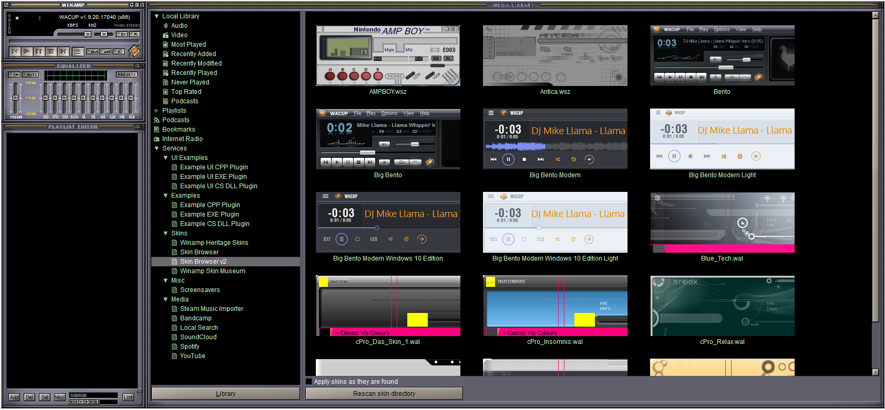

# WinampEasyService
Making it easier to integrate services with good old WinAmp

Goal:
* Make it easier to write plugins and integrate services into WinAmp and WACUP

Installing plugins:
* Put the ml_easysrv and in_easyfngetter plugins in the WACUP `Plugins` folder
* Also put isrv_managed and isrv_web in the WACUP `Plugins` folder
* Put any service plugins (`esrv_\*.exe, msrv_\*.dll, srv_\*.dll, wsrv_\*.html`) in the same folder
* The services will be accessible in the `Services` tree of the Media Library

Using plugins (Instead of this, plugins can now provide their own custom UI):
* Press the `Invoke plugin` button to interact with the selected service
* Double click an entry in the list to play it
* Alt + double click an entry in the list to enqueue it
* Right click an entry for more options

Service plugin development:
* Managed (.NET based) DLLs have to be named `msrv_\*.dll` and contain the `msrv.EasyService` class implementing the following:
    * `public void InitService(Dictionary<string, object> functionDict, string pluginDir, uint serviceID)`
        * `functionDict` contains the following functions:
            * `string GetOption(string optionName, string defaultValue)`
            * `void SetOption(string optionName, string optionValue)`
            * `void SkinForm(Form form)`
    * `public Tuple<string, string, string, uint> GetNodeDesc()` should return a tuple with the following information:
        * Category
        * Node name you wish to show in the Media Library
        * The column names you wish to show in the Media Library, delimited by `\t`
        * Capabilities (0):
            * `const uint CAP_DEFAULT = 0;` for no additional capabilities
            * `const uint CAP_CUSTOMDIALOG = 1;` for custom UI support
    * `public List<List<string>> InvokeService(IntPtr hwndWinampParent, IntPtr hwndLibraryParent, IntPtr hwndParentControl, string skinPath)` should return the entries to populate the Media Library ListView with
        * The inner lists should always contain three strings in this order: Column contents delimited by `\t`, Title to show in the playlist, Filename
        * The filename can be a direct filename (e.g. `e:\\example.mp3`) or a reference (e.g. `ref_examplefile`)
    * Optional: `public string GetFileName(string fileID)` should return the direct filename when called with a reference
    * Important: If you wish to show a window, call `ShowWindow(form.Handle, SW_SHOW);` on your Form after creation
        * ShowWindow resides in `user32.dll`, `SW_SHOW` equals 5
    * Full example: `WinampEasyService\\msrv_exampledll`
* Managed (.NET based) DLLs with custom UIs have to be named `msrv_\*.dll` and contain the `msrv.EasyService` class implementing the following:
    * `public void InitService(Dictionary<string, object> functionDict, string pluginDir, uint serviceID)`
        * `functionDict` contains the following functions:
            * `string GetOption(string optionName, string defaultValue)`
            * `void SetOption(string optionName, string optionValue)`
            * `void SkinForm(Form form)`
    * `public Tuple<string, string, string, uint> GetNodeDesc()` should return a tuple with the following information:
        * Category
        * Node name you wish to show in the Media Library
        * The column names you wish to show in the Media Library, delimited by `\t`
        * Capabilities (1):
            * `const uint CAP_DEFAULT = 0;` for no additional capabilities
            * `const uint CAP_CUSTOMDIALOG = 1;` for custom UI support
	* `public UserControl GetCustomDialog(IntPtr hwndWinampParent, IntPtr hwndLibraryParent, IntPtr hwndParentControl, string skinPath)` should return the `System.Windows.Forms.UserControl` you'd like to show
* Unmanaged DLLs have to be named `srv_\*.dll` and implement the functions in `WinampEasyService\\ml_easysrv\\easysrv.h`:
    * `void InitService(AddItemFunc addItemFunc, GetOptionFunc getOptionFunc, SetOptionFunc setOptionFunc, const wchar_t\* pluginDir, UINT_PTR serviceID)`:
        * The function pointers are described in `easysrv.h`:
            * `typedef void (\*AddItemFunc)(const wchar_t\* displayInfo, const wchar_t\* playlistInfo, const wchar_t\* filename, UINT_PTR serviceID);`
            * `typedef void (\*GetOptionFunc)(UINT_PTR serviceID, const wchar_t\* optionName, const wchar_t\* defaultValue, wchar_t\* output, DWORD outputSize);`
            * `typedef void (\*SetOptionFunc)(UINT_PTR serviceID, const wchar_t\* optionName, const wchar_t\* optionValue);`
    * `NodeDescriptor GetNodeDesc()` should return a NodeDescriptor struct with the following information:
        * Category
        * Node name you wish to show in the Media Library
        * The column names you wish to show in the Media Library, delimited by `\t`
        * Capabilities (0):
            * `#define CAP_DEFAULT 0u` for no additional capabilities
            * `#define CAP_CUSTOMDIALOG 1u` for custom UI support
    * `void InvokeService(HWND hwndWinampParent, HWND hwndLibraryParent, HWND hwndParentControl, wchar_t\* skinPath)` should call AddItemFunc as many times as needed
        * Filenames can be direct filenames (e.g. `e:\\example.mp3`) or references (e.g. `ref_examplefile`)
    * Optional: `const wchar_t\* GetFileName(const wchar_t\* fileID)` should return the direct filename when called with a reference
    * Full example: `WinampEasyService\\srv_exampledll`
* Unmanaged DLLs with custom UIs have to be named `srv_\*.dll` and implement the functions in `WinampEasyService\\ml_easysrv\\easysrv.h`:
    * `void InitService(AddItemFunc addItemFunc, GetOptionFunc getOptionFunc, SetOptionFunc setOptionFunc, const wchar_t\* pluginDir, UINT_PTR serviceID)`:
        * The function pointers are described in `easysrv.h`:
            * `typedef void (\*AddItemFunc)(const wchar_t\* displayInfo, const wchar_t\* playlistInfo, const wchar_t\* filename, UINT_PTR serviceID);`
            * `typedef void (\*GetOptionFunc)(UINT_PTR serviceID, const wchar_t\* optionName, const wchar_t\* defaultValue, wchar_t\* output, DWORD outputSize);`
            * `typedef void (\*SetOptionFunc)(UINT_PTR serviceID, const wchar_t\* optionName, const wchar_t\* optionValue);`
    * `NodeDescriptor GetNodeDesc()` should return a NodeDescriptor struct with the following information:
        * Category
        * Node name you wish to show in the Media Library
        * The column names you wish to show in the Media Library, delimited by `\t`
        * Capabilities (1):
            * `#define CAP_DEFAULT 0u` for no additional capabilities
            * `#define CAP_CUSTOMDIALOG 1u` for custom UI support
    * `HWND GetCustomDialog(HWND _hwndWinampParent, HWND _hwndLibraryParent, HWND hwndParentControl, wchar_t\* skinPath)` should return the HWND of the newly created child dialog
    * Full example: `WinampEasyService\\srv_cdlexampledll`
* EXE files (doesn't matter if managed or unmanaged) have to be named `esrv_\*.exe` and respond to the following command line arguments:
    * `GetNodeDesc`: Print the following information to STDOUT:
        * Category
        * Node name you wish to show in the Media Library
        * The column names you wish to show in the Media Library, delimited by `\t`
        * Capabilities (0):
            * `const uint CAP_DEFAULT = 0;` for no additional capabilities
            * `const uint CAP_CUSTOMDIALOG = 1;` for custom UI support
    * `InvokeService hwndWinampParent hwndLibraryParent hwndParentControl pluginDir skinPath configFileName shortName serviceID`: Print the entries to populate the Media Library ListView with to STDOUT in the following way:
        * Column contents delimited by `\t`
        * Title to show in the playlist
        * Filename
            * Filenames can be direct filenames (e.g. `e:\\example.mp3`) or references (e.g. `ref_examplefile`)
    * Optional: `GetFileName FileID`: Print the direct filename corresponding to the reference `FileID` to STDOUT
    * Important: If you wish to show a window, you might have to call `ShowWindow(form.Handle, SW_SHOW);` on your Form after creation
        * ShowWindow resides in `user32.dll`, `SW_SHOW` equals 5
    * Full example: `WinampEasyService\\esrv_exampleexe`
* EXE files (doesn't matter if managed or unmanaged) with custom UIs have to be named `esrv_\*.exe` and respond to the following command line arguments:
	* `GetNodeDesc`: Print the following information to STDOUT:
        * Category
        * Node name you wish to show in the Media Library
        * The column names you wish to show in the Media Library, delimited by `\t`
        * Capabilities (1):
            * `const uint CAP_DEFAULT = 0;` for no additional capabilities
            * `const uint CAP_CUSTOMDIALOG = 1;` for custom UI support
	* `GetCustomDialog hwndWinampParent hwndLibraryParent hwndParentControl pluginDir skinPath configFileName shortName serviceID`: Show a correctly set up window
	* Important: If you wish to show a window, you might have to call `ShowWindow(form.Handle, SW_SHOW);` on your Form after creation
        * ShowWindow resides in `user32.dll`, `SW_SHOW` equals 5
    * Full example: `WinampEasyService\\esrv_cldexampleexe`
* HTML files have to be named `wsrv_\*.html` and implement the following:
    * Implement the function `function getNodeName()` that returns the node name you wish to show in the Media Library
    * Make use of the `window.winamp` object, which provides the following functions:
        * `string getoption(string optionName, string defaultValue)`
        * `void setoption(string optionName, string optionValue)`
        * `void additem(string filename, bool enqueue)`
    * Full example: `WinampEasyService\\WebExamples\\wsrv_example.html`

# ServicePlugins

The following plugins have been developed using this framework:
* esrv_bandcamp: Bandcamp integration
    * Needs a username and the content of the identity cookie
    * Can save credentials for later
    * Only works for purchased items
    * Works for both tracks and albums
* esrv_localsearch: Local file search
    * Searches the given directory for the given file pattern
    * Has recursive search option
* esrv_soundcloud: SoundCloud integration
    * Uses SoundCloudExplode under the hood
* msrv_skinner: Spawn overlays to skin other windows' titlebars
* msrv_soundcloud_plus: SoundCloud integration with better UI
* esrv_spotify: Spotify integration
    * Falls back to YouTube if a track is unavailable and its YouTube ID is set
    * Uses SpotifyExplode and YouTubeExplode under the hood
* esrv_youtube: YouTube integration
    * Unfortunately slow
    * Uses YouTubeExplode under the hood
* srv_skinbrowser: Browse and switch WinAmp skins right from the Media Library!
    * Presumes the `Skins` directory is next to the `Plugins` directory
    * Updates the filelist with newly appeared files every second
    * Automatically applies newly added skins if checkbox is checked
* srv_skinbrowser2: Browse and switch WinAmp skins from the Media Library using thumbnails!
    * Presumes the `Skins` directory is next to the `Plugins` directory
    * Updates the filelist with newly appeared files and thumbnails every second
    * Automatically applies newly added skins if checkbox is checked
* srv_skinmuseum: Browse the WinAmp Skin Museum right from the Media Library
    * Double click to download and set a skin
    * Click "Keep current skin" to copy the last set skin from the current page to your Skins directory
        * This only works if you have Write rights to the directory
* srv_steamimport: Import the soundtracks you downloaded on steam to the Local Library or into individual playlists!
* srv_heritageskins: Browse the WinAmp Heritage Skin colleciton right from the Media Library
    * Double click to download and set a skin
    * Click "Keep current skin" to copy the last set skin from the current page to your Skins directory
        * This only works if you have Write rights to the directory
    * Default category can be set in the config file
* srv_screensavers: Watch screensavers in the Media Library

Common operation:
* Most plguins, including the main ml_easysrv plugin, can be configured by editing the `easysrv.ini` file
* Downloaded files and saved credentials are stored in `System.IO.Path.GetTempPath()`, unless specified otherwise

# Screenshot

